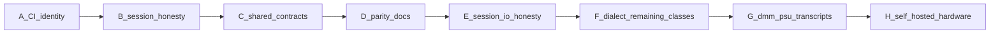

# Roadmap

Dual-native work follows [dual-native-plan.md](dual-native-plan.md). Streams A–G and Stream H's self-hosted DMM smoke infrastructure are implemented in this checkout. Workflow implementation is not passing hardware evidence. `0.2.0` stays deferred until a passing hardware run is recorded.

**Still deferred:** package publishing (`0.2.0`), UniFFI, process-supervised HAL, IVI Config Store / `IIvi*` conformance, vendor VISA on GitHub-hosted CI.

**Implemented separately (C# only):** OpenTAP supports all eight instrument types, 74 steps, session injection, provider registration, and the optional VISA companion — see [opentap-consumer.md](opentap-consumer.md). F is already merged; this track does not implement G or H.

Neither NI nor Keysight ships a CI-loadable VISA/instrument emulator. GitHub-hosted CI stays on MockTransport + transcripts. See [Hardware emulators](dual-native-plan.md#hardware-emulators-ni--keysight).

Dialect profiles live under `crates/instrument-core/data/dialects/` and `spec/vendors/`, generated via `tools/gen-dialects.ts`.

## October 2026 code-review resolution

The linked review's uncommitted quick fixes were absent from this checkout.
This batch implements them and the remaining code findings. No package version
was bumped and nothing was published. Release scope remains the Rust crates plus
the core/VISA NuGet packages; OpenTAP TapPackage/companion publishing remains
separate. The existing hardware prerequisite for `0.2.0` still applies.

| Finding | Resolution and coverage |
| --- | --- |
| Discovery and failed-construction leaks | Probe sessions are disposed before catalog return. SCPI constructors consume owned transports even on configuration failure; injected I/O honors explicit ownership. Unsupported VISA resource types are disposed. Cancellation propagates after cleanup. Counting/failing transports, unsupported session proxies, and cancelled native opening cover these boundaries. |
| Lost first error | Sync/async Rust and C# retain actual error entries consumed by destructive `SYST:ERR?` probes and drain the live queue on later checks. An earlier zero reply is not cached as evidence that the queue is still empty. Shared [review vectors](../spec/review-regressions.json) and command-between-probe-and-check tests cover empty, single/multiple errors, unsupported replies, and errors arriving after an empty probe. |
| Completion false success | Waits issue one `*OPC?` with a 30-second read budget, with no short support probe or retries that multiply the budget. Fragment reads use the remaining time. Invalid/unsupported replies and timeouts cannot report success; probe transport failures are inconclusive and are not cached as unsupported. |
| Async VISA caller blocking | The bridge and opener offload native synchronous calls. Transport calls and complete session query transactions are serialized. Queued work can be cancelled; a running native call retains its buffer until completion under its timeout. Dispose waits before closing. Regression tests use gated native calls, concurrent queries, and cancelled native opening. |
| PSU shutdown | Channel metadata or an explicit physical count determines the shutdown set, extended by outputs enabled through any shared view. OFF failures do not prevent attempts on other channels. Generic devices without an explicit count disable known outputs and then report unsupported shutdown. Core callers set `Session.PowerSupplyChannelCount`; OpenTAP has an `Output Channels` setting with golden-contract and TapPlan coverage. |
| NaN/infinite OpenTAP pass | Nonfinite scalars, samples, and traces fail. Limits and optional numeric parameters must be finite, validated in the editor and at execution. |
| Release tag/version mismatch | [Release validation](../tools/validate-release.ts) checks the tag against Rust, NuGet, and internal Rust dependency versions before publication jobs. Packing receives the validated version. Duplicate publication is a visible failure. The combined release scope is retained. |
| Shared-session concurrency/health | Complete SCPI queries serialize I/O. `SessionPool.WithSession` holds the shared SCPI lock across multi-command transactions; the old `Lock` accessor is obsolete. Pool ownership is disposable. Catalog references and diagnostics share one health lock per address; concurrent counter/snapshot tests cover it. |
| False capability classifications | Generated probes validate instrument-specific reply shapes. Finite signed DMM measurements and PSU voltage setpoints remain valid evidence; frequency and other nonnegative probes retain their bounds. Error-only and generic output-only responders support no kinds. PSU detection requires additional supply-setpoint evidence. Async cancellation propagates. Shared reply vectors and sync/async negative-voltage discovery tests are consumed by both languages. |
| Mock truncation, recorder lifetime, addresses | Rust/C# mock reads retain unread response bytes. C# recording wrappers dispose once or explicitly transfer ownership. Standard SOCKET port tokens parse correctly in both languages, while INSTR logical names remain separate. |
| Instrument API and vendor errors | Malformed PSU states use the library parse exception. N6705 ON/OFF remote sense fails explicitly as unsupported in both languages, avoiding its known-invalid fallback. VISA status codes replace message-text guesses; transport/allocation failures retain their causes. |
| DMM READ/FETCH units and reattachment | Units follow typed DMM configuration across shared views; an unknown function or reset clears the unit. Current/resistance configure/acquire plans assert published units. Failed timeout setup during reattachment disconnects coherently and permits retry without disposing host-owned I/O. |
| Fragmented binary-block terminators | Sync/async Rust/C# skip separately delivered optional CR/LF after a definite block. Shared fragmented payload/terminator vectors assert the next query's response. This does not add binary scope capture. |
| Package docs and hardware suite overlap | Packaged README links are absolute and installation uses packages. Hardware suites run sequentially for one instrument, including C#-only dispatch. Async cancellation and supported-resource limits are documented in the published guides. |
| Dependency audit | Test dependencies now use xUnit 2.9.3 and its 2.8.2 VS adapter, removing legacy HTTP/regex advisories. The current NuGet audit reports no vulnerable packages in the solution. |

### Validation and remaining release evidence

- Merge-review follow-up: the empty-probe/new-error and signed-voltage discovery regressions pass in synchronous and asynchronous Rust/C#. The .NET 8 Release non-hardware suite passes 220 tests; Rust sync workspace passes 79 tests and async core passes 58. CI-equivalent clippy, formatting, and shared-generator drift checks pass. These checks do not exercise physical instruments.
- .NET Release solution: zero warnings or errors; 213 non-hardware tests pass.
- Rust sync workspace: 77 passed; async core: 54 passed; async facade: 40 passed.
- Rust clippy with warnings denied and VISA/tokio compile check pass.
- Shared-table/dialect/OpenTAP generation repeats without drift; operation and release validators pass.
- Core/VISA NuGet packages pack with aligned 0.1.0 internal dependencies. A fresh package-only local-feed consumer returns 3.3 V.
- The current NuGet vulnerability audit finds no advisories, including test dependencies.
- Additional hardware-free checks pass with .NET SDK 9.0.318: the Release solution build has zero warnings or errors, and all 213 tests targeting .NET 8 pass both normally and with `DOTNET_ROLL_FORWARD=LatestMajor` to exercise the .NET 9 runtime. OpenTAP 9.32.2 on the .NET 9 runtime creates the TapPackage; archive contents, uninstall/reinstall, installed-package integrity, and CLI plugin discovery pass. A fresh .NET 9 consumer referencing only the installed package DLLs executes the mock plan with `Verdict=Pass`. The mock plan now returns `1` for `*OPC?`, matching the completion contract.
- Rust documentation builds with warnings denied, and the `instrument-core` crate packages and verifies from its packaged sources. The VISA crate also passes the Windows GNU cross-compilation check; this does not exercise a Windows runtime or vendor driver. The synchronous and asynchronous C# fixture examples return 3.3 V and 1 V, respectively.
- .NET SDK 10.0.401 builds the Release solution with zero warnings or errors. All 213 non-hardware tests pass on runtime 10.0.12 using `DOTNET_ROLL_FORWARD=LatestMajor`; host tracing confirms the test processes load .NET 10. A fresh `net10.0` consumer restores the locally packed core/VISA NuGet packages into an isolated cache, resolves the VISA assembly without opening a native resource manager, and returns 3.3 V through both sync and async APIs. The libraries retain their `net8.0` target.
- OpenTAP 9.32.2 also passes package creation, archive inspection, uninstall/reinstall, and integrity verification on the .NET 10 runtime. A fresh `net10.0` consumer using the installed package DLLs executes the mock plan with `Verdict=Pass`. CI now covers .NET 10 builds, runtime tests, and package consumers on Linux and Windows, plus Linux TapPackage lifecycle checks on .NET 9 and 10. Windows CI results remain separate from native vendor VISA runtime validation.

The automated checks use mocks and transcripts, not physical instruments.

Before `0.2.0`, record a passing self-hosted hardware run with the revision,
instrument identity, VISA/runtime version, runner, date, results, and run link.
Verify that discovery releases exclusive locks and every physical PSU output is
disabled. Windows vendor runtime behavior still needs a supported Windows runner;
the Linux net9 TapPackage lifecycle is now verified locally. Vendor
LF-terminated SOCKET I/O remains unverified, so the supported hardware smoke path
uses INSTR resources. NuGet/crates account ownership and publishing credentials
were not checked and no publication was attempted. N6705 INT/EXT remote sense
remains an explicitly unsupported feature pending vendor coverage.
